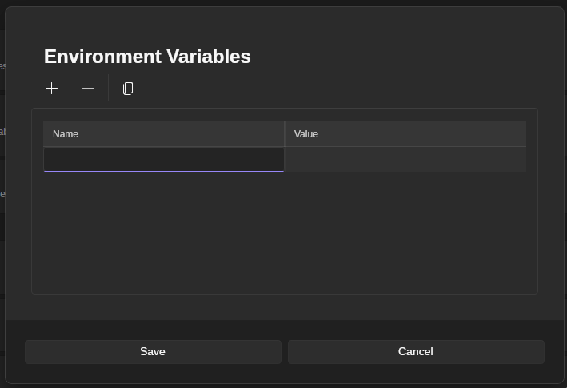
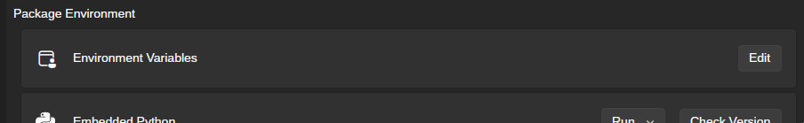

# Environment Variables

Environment variables can be set globally in Stability Matrix and are injected into every package's process environment each time it is launched, making them a powerful way to configure packages and PyTorch behavior without editing scripts or shell profiles.

[`Section Overview`](overview.md) | [`Home`](../README.md)

## Table of Contents

- [Setting Environment Variables](#setting-environment-variables)
- [Common Environment Variables](#common-environment-variables)
- [PyTorch and CUDA Variables](#pytorch-and-cuda-variables)
- [HuggingFace Cache Variables](#huggingface-cache-variables)
- [AMD and ROCm Variables](#amd-and-rocm-variables)

---

## Setting Environment Variables

Environment variables in Stability Matrix are configured from a single global editor. Any variable you add there is injected into every package launched by Stability Matrix from that point onward.

To add or change environment variables:

1. Open `Settings`.

2. Go to `Package Environment`.
3. Find `Environment Variables` and click `Edit`.

4. In the editor dialog, click `+` to add a new row.
5. Enter the variable name in the `Name` column and its value in the `Value` column.
6. Repeat for any additional variables you want to define.
7. Click `Save`.

Changes apply to future package launches. If a package is already running, restart it so the new environment variables are picked up.

Because these variables are global, use them carefully. A change meant for one package can also affect other packages if they read the same variable name.

## Common Environment Variables

These variables are commonly useful in Stability Matrix because they affect package installation, runtime discovery, cache placement, or low-level process loading without being tied to a single web UI or model family.

Not every package will use every variable below, but these are some of the most practical ones when you need to adjust how packages are found, installed, or launched.

| Variable | Example Value | Purpose |
|---|---|---|
| `PATH` | `Linux/macOS: /opt/custom/bin:/usr/local/bin:/usr/bin` `Windows: C:\Tools;C:\Windows\System32` | Controls where the OS looks for executables and shared tooling. This is useful when a helper binary or compiler needs to be found before the system default. |
| `LD_PRELOAD` | `/usr/lib/libtcmalloc.so` | Preloads a shared library before the target process starts. This is mainly a Linux and macOS troubleshooting variable for advanced cases such as custom allocators, compatibility shims, or injected hooks. |
| `PIP_CACHE_DIR` | `Linux/macOS: /mnt/drive/pip-cache` `Windows: D:\pip-cache` | Moves pip's download and wheel cache to a different drive. This can help when your system drive is small or you want repeated installs to reuse cached artifacts. |
| `PIP_TIMEOUT` | `60` | Sets pip's HTTP timeout in seconds. This is useful when downloads fail on slower connections, high-latency links, or package sources that respond slowly. |
| `PIP_RETRIES` | `8` | Controls how many times pip retries failed network requests. This can help when installs are mostly working but occasionally fail because of transient connection or CDN issues. |
| `UV_CACHE_DIR` | `Linux/macOS: /mnt/drive/uv-cache` `Windows: D:\uv-cache` | Moves uv's cache directory. Useful for reducing repeated downloads and moving uv's cache workload off a smaller system drive. |
| `UV_HTTP_TIMEOUT` | `60` | Sets uv's HTTP read timeout in seconds. This is useful when package resolution or downloads fail because the remote server responds too slowly for the default timeout. |
| `UV_HTTP_CONNECT_TIMEOUT` | `30` | Sets how long uv waits for the initial connection to a server. This is most useful when package sources are reachable but slow to establish connections. |
| `UV_HTTP_RETRIES` | `5` | Controls how many times uv retries failed HTTP requests. This can help when downloads intermittently fail because of unstable networking or remote mirror issues. |
| `DOTNET_ROOT` | `Linux/macOS: /usr/share/dotnet` `Windows: C:\Program Files\dotnet` | Tells .NET where to find the runtime and shared frameworks. This is the main .NET environment variable to check when a .NET-based helper or component cannot locate the expected runtime. |

For most users, the most practical variables here are `PATH`, package-manager cache and network variables (`PIP_*` and `UV_*`), and `DOTNET_ROOT` when runtime discovery does not behave as expected. `LD_PRELOAD` is powerful, but it is mainly an advanced Linux/MacOS troubleshooting tool rather than a routine Stability Matrix setting.

## PyTorch and CUDA Variables

These variables are the ones most users are likely to encounter when debugging GPU detection, stabilizing memory usage, or forcing specific CUDA behavior.

Some of them are general PyTorch controls, while others affect CUDA libraries such as cuDNN or cuBLAS. Most users should only change them when troubleshooting a specific issue.

| Variable | Example Value | Purpose |
|---|---|---|
| `PYTORCH_ALLOC_CONF` | `max_split_size_mb:512,garbage_collection_threshold:0.8` | Tunes PyTorch's GPU memory allocator. This is one of the most useful variables for reducing fragmentation, mitigating OOM errors, or improving stability on workloads with changing tensor sizes. `PYTORCH_CUDA_ALLOC_CONF` is the backward-compatible alias on NVIDIA/CUDA paths, and `PYTORCH_HIP_ALLOC_CONF` is the corresponding alias on AMD ROCm/HIP paths. |
| `PYTORCH_NVML_BASED_CUDA_CHECK` | `1` | Tells PyTorch to use NVML to verify CUDA availability before importing CUDA-dependent modules. This can help on systems where CUDA initialization fails in forked or unusual process-launch scenarios. |
| `CUDA_VISIBLE_DEVICES` | `0` or `0,1` | Restricts which NVIDIA GPUs are visible to CUDA. Useful on multi-GPU systems when you want a package to run on only one device or a chosen subset of devices. |
| `HIP_VISIBLE_DEVICES` | `0` or `0,1` | Restricts which GPUs are visible to HIP applications. This is the AMD/HIP-side GPU isolation variable and is especially relevant on Windows ROCm/HIP setups. |
| `ROCR_VISIBLE_DEVICES` | `0` or `0,GPU-0123456789abcdef` | Restricts which GPUs are exposed through the ROCR runtime by device index or UUID. AMD recommends this as the preferred GPU-isolation variable on Linux ROCm systems. |
| `CUDA_LAUNCH_BLOCKING` | `1` | Forces CUDA calls to run synchronously. This is slower, but very useful for debugging crashes because errors are reported closer to the operation that triggered them. |

For a broader reference beyond the most commonly useful variables here, see the [official PyTorch environment variable documentation](https://docs.pytorch.org/docs/stable/torch_environment_variables.html).

### TunableOp Variables

PyTorch TunableOp is a more advanced tuning system for selecting the fastest implementation for certain GPU operations. In practice, it is especially relevant on ROCm and hipBLASLt-style paths, and Stability Matrix already enables `PYTORCH_TUNABLEOP_ENABLED=1` automatically for some Windows ROCm-based ComfyUI setups.

Most users do not need these variables unless they are experimenting with ROCm tuning, offline tuning workflows, or advanced low-level performance debugging. Tuning on Nvidia GPUs may only provide negligible results.

| Variable | Example Value | Purpose |
|---|---|---|
| `PYTORCH_TUNABLEOP_ENABLED` | `1` or `0` | Enables or disables TunableOp itself. |
| `PYTORCH_TUNABLEOP_TUNING` | `0` or `1` | Controls whether tuning runs when no cached result exists. Set to `0` if you want TunableOp enabled but do not want it benchmarking kernels during the current run. `1` is implied by default. |
| `PYTORCH_TUNABLEOP_FILENAME` | `Linux/macOS: /home/username/tuning/tunableop_results.csv` `Windows: D:\tuning\tunableop_results.csv` | Sets the CSV file used for reading and writing tuned results. This can be a full path, which is useful when you want to keep tuning files outside the package directory or reuse a tuning database across runs or workloads. If unset, the CSV is written in the package's root directory and remains package-specific. |
| `PYTORCH_TUNABLEOP_MAX_TUNING_DURATION_MS` | `60` | Caps how long TunableOp spends benchmarking each candidate solution, in milliseconds. Raising it may improve result quality, while lowering it reduces startup overhead. |
| `PYTORCH_TUNABLEOP_MAX_TUNING_ITERATIONS` | `200` | Caps how many iterations TunableOp uses while timing each candidate solution. Useful when you want more stable tuning results or shorter tuning passes. |
| `PYTORCH_TUNABLEOP_VERBOSE` | `1` | Enables verbose TunableOp logging. Higher levels produce more detailed diagnostic output. |
| `PYTORCH_TUNABLEOP_VERBOSE_FILENAME` | `out` | Sends TunableOp verbose output to stderr, stdout, or a file, depending on the value. Useful when capturing tuning diagnostics. |

For more detail on TunableOp behavior and the wider set of tuning controls, see the [official PyTorch TunableOp documentation](https://docs.pytorch.org/docs/stable/cuda.tunable.html).

For ordinary Stability Matrix usage, the most practical variables here are `PYTORCH_ALLOC_CONF`, `CUDA_VISIBLE_DEVICES`, and `CUDA_LAUNCH_BLOCKING`. The TunableOp variables are mainly for advanced ROCm, ZLUDA-adjacent, or kernel-selection troubleshooting workflows.

## HuggingFace Cache Variables

These variables are useful when a package downloads models, tokenizers, datasets, or other assets from the Hugging Face ecosystem. In Stability Matrix, the most common reasons to set them are moving caches off the system drive, forcing offline operation, or making Hub requests more reliable on slow connections. These mainly modify HuggingFace operations within packages themselves, such as HF features built into WebUIs or HF-download-capable extensions and custom nodes.

Because Stability Matrix injects environment variables globally, remember that authentication or offline-mode settings here will affect every launched package that uses `huggingface_hub`, `transformers`, `datasets`, or a library built on top of them.

| Variable | Example Value | Purpose |
|---|---|---|
| `HF_HOME` | `Linux/macOS: /mnt/drive/huggingface` `Windows: D:\huggingface` | Moves the main Hugging Face home directory. This is the simplest way to relocate the overall cache root, including Hub downloads, tokens, and other Hugging Face-managed data. |
| `HF_HUB_CACHE` | `Linux/macOS: /mnt/drive/hf-hub` `Windows: D:\hf-hub` | Moves the Hub cache used for downloaded model, dataset, and Space repositories. Use this when you want to relocate Hub downloads specifically without moving every other Hugging Face cache. |
| `HF_ASSETS_CACHE` | `Linux/macOS: /mnt/drive/hf-assets` `Windows: D:\hf-assets` | Moves the assets cache used by downstream libraries for preprocessed files, logs, and downloaded helper assets. Useful when packages generate large auxiliary files outside the main Hub cache. |
| `HF_DATASETS_CACHE` | `Linux/macOS: /mnt/drive/hf-datasets` `Windows: D:\hf-datasets` | Moves the `datasets` library's Arrow and index cache. This is useful when a workflow downloads or preprocesses Hugging Face datasets and you want those files on a larger or faster drive. |
| `HF_HUB_OFFLINE` | `1` | Forces Hugging Face libraries to use cached files only and skip Hub HTTP calls. This is useful for air-gapped setups, repeatable offline launches, or troubleshooting workflows that should not hit the network. |
| `HF_TOKEN` | `hf_xxxxxxxxxxxxxxxxxxxx` | Supplies a Hugging Face access token through the environment. This is mainly useful for gated models, private repositories, or automated launches where interactive login is not practical. |
| `HF_HUB_ETAG_TIMEOUT` | `3` or `10` | Sets how long Hugging Face waits for metadata checks before falling back to cached files. Lower values can make already-cached launches feel faster on slow or unreliable connections. |
| `HF_HUB_DOWNLOAD_TIMEOUT` | `60` | Sets the file download timeout in seconds. Increase this when large model downloads fail on slower connections or unstable mirrors. |
| `HF_ENABLE_PARALLEL_LOADING` | `true` | Enables parallel loading for supported `transformers` weight files. This can reduce startup time for very large multi-shard models, but usually does not matter for smaller models. |
| `HF_PARALLEL_LOADING_WORKERS` | `4` or `8` | Controls how many worker threads `transformers` uses when parallel loading is enabled. This is mainly an advanced tuning variable for large-model loading performance. |

For most users, `HF_HOME` is the best first choice because it relocates the overall Hugging Face cache root cleanly. If you only need part of the cache moved, `HF_HUB_CACHE`, `HF_ASSETS_CACHE`, and `HF_DATASETS_CACHE` let you split the different cache types across drives.

If you need a full reference beyond the most practical variables here, see the [official Hugging Face Hub environment variable documentation](https://huggingface.co/docs/huggingface_hub/en/package_reference/environment_variables), the [Datasets cache documentation](https://huggingface.co/docs/datasets/en/cache), and the [Transformers environment variable documentation](https://huggingface.co/docs/transformers/en/reference/environment_variables).

## AMD and ROCm Variables

These variables are mainly useful on AMD ROCm-based installs when you need to debug HIP runtime issues, tune MIOpen behavior, or enable ROCm-specific performance paths. GPU-isolation variables such as `ROCR_VISIBLE_DEVICES` and `HIP_VISIBLE_DEVICES` were already covered in the PyTorch section above because they are commonly used there as well.

Most users should leave these alone unless they are troubleshooting a specific ROCm issue. Many of the lower-level debug variables can slow workloads down significantly or produce very large logs.

| Variable | Example Value | Purpose |
|---|---|---|
| `AMD_LOG_LEVEL` | `3` or `4` | Enables HIP runtime logging. This is one of the most useful ROCm-side debugging variables when you need to see runtime errors, warnings, or detailed device initialization behavior. |
| `AMD_LOG_LEVEL_FILE` | `Linux/macOS: /tmp/hip-runtime.log` `Windows: C:\temp\hip-runtime.log` | Sends HIP runtime logging to a file instead of stderr. Useful when a package launches from Stability Matrix and you want a persistent ROCm log to inspect after the process exits. |
| `HIP_LAUNCH_BLOCKING` | `1` | Forces HIP kernel launches to run synchronously. This is the ROCm-side equivalent of serialized GPU execution and is useful when crashes or invalid-memory-access errors need to be reported closer to the operation that triggered them. |
| `HSA_ENABLE_SDMA` | `0` or `1` | Controls whether ROCr uses DMA engines for memory copies. Disabling it can sometimes help isolate copy-path issues or instability, while leaving it enabled is the normal higher-performance setting. |
| `MIOPEN_FIND_MODE` | `FAST` or `2` | Controls how MIOpen chooses and benchmarks convolution solvers. `FAST` mode is a practical speed-oriented choice that reduces find overhead, and Stability Matrix already applies `MIOPEN_FIND_MODE=2` automatically for some Windows ROCm-based ComfyUI setups. |
| `MIOPEN_FIND_ENFORCE` | `SEARCH_DB_UPDATE` | Forces more aggressive auto-tuning and performance-database updates. This is mainly useful when benchmarking, testing new kernels, or trying to recover from poor cached solver choices. |
| `MIOPEN_COMPILE_PARALLEL_LEVEL` | `4` | Controls how many threads MIOpen uses while compiling kernels during find operations. Raising it can reduce first-run kernel compilation time on CPUs with enough cores. |
| `MIOPEN_ENABLE_LOGGING` | `1` | Enables basic MIOpen logging. Useful when you need to confirm whether MIOpen is being used at all and what layer-by-layer operations it is handling. |
| `MIOPEN_LOG_LEVEL` | `5` | Sets MIOpen log verbosity. Higher values provide more detailed internal logging and are useful when debugging solver selection, kernel compilation, or runtime failures. |
| `MIOPEN_CHECK_NUMERICS` | `0x02` or `0x04` | Checks tensors for NaNs, infinities, and related numerical problems. This is useful when a ROCm workflow produces corrupted outputs or starts failing only on certain models or resolutions. |
| `MIOPEN_GEMM_ENFORCE_BACKEND` | `5` | Overrides MIOpen's GEMM backend selection. This is an advanced tuning variable that can be useful when comparing rocBLAS and hipBLASLt behavior or isolating backend-specific regressions. |
| `COMFYUI_ENABLE_MIOPEN` | `1` | Tells ComfyUI to keep the MIOpen-backed path enabled on ROCm builds where it may otherwise be disabled by default. Without this enabled, ComfyUI disables the `cudnn` backend path in its backend calls for RDNA3, RDNA3.5, and RDNA4 AMD GPUs, which in turn disables the MIOpen-backed functions that rely on that path. This variable is needed for MIOpen to function properly in those setups. |
| `TORCH_ROCM_AOTRITON_ENABLE_EXPERIMENTAL` | `1` | Enables the experimental ROCm AOTriton path in compatible PyTorch builds. In Stability Matrix's Windows ROCm ComfyUI integration, this is used for TheRock technical-preview PyTorch builds to enable AOTriton-provided built-in Flash Attention and PyTorch SDPA memory-efficient attention paths. |

For some Windows ROCm-based ComfyUI launches, Stability Matrix already applies several of these optimizations automatically in package code, including:

`MIOPEN_FIND_MODE=2`

`MIOPEN_SEARCH_CUTOFF=1`

`MIOPEN_FIND_ENFORCE=1`

`TORCH_ROCM_AOTRITON_ENABLE_EXPERIMENTAL=1` (RDNA3 / RDNA3.5 / RDNA4 only, and additionally excluded on the gfx1152/gfx1153 APU architectures where AOTriton isn't yet supported)

`FLASH_ATTENTION_TRITON_AMD_ENABLE=TRUE`

`COMFYUI_ENABLE_MIOPEN=1` (RDNA3 / RDNA3.5 / RDNA4 only, no gfx1152/gfx1153 exclusion)

`PYTORCH_ALLOC_CONF=max_split_size_mb:512,garbage_collection_threshold:0.8`

Linux installs do not currently get the same automatic overrides, so they will need to be enabled by the user.

If you're using the ComfyUI-Zluda package specifically, it also sets its own environment variables at launch on top of the above: `FLASH_ATTENTION_TRITON_AMD_ENABLE=TRUE`, `MIOPEN_FIND_MODE=2`, `MIOPEN_LOG_LEVEL=3`, and `ZLUDA_COMGR_LOG_LEVEL=1`. If you're wondering why those already appear to be set for a ZLUDA install, this is why.

Whatever you set in Stability Matrix's own environment-variable editor is applied last, so it always overrides these auto-applied defaults if the same variable name is used.

For a broader reference, see the [official ROCm environment variable documentation](https://rocm.docs.amd.com/en/latest/reference/env-variables.html) and the [official MIOpen environment variable documentation](https://rocm.docs.amd.com/projects/MIOpen/en/latest/reference/env_variables.html).

